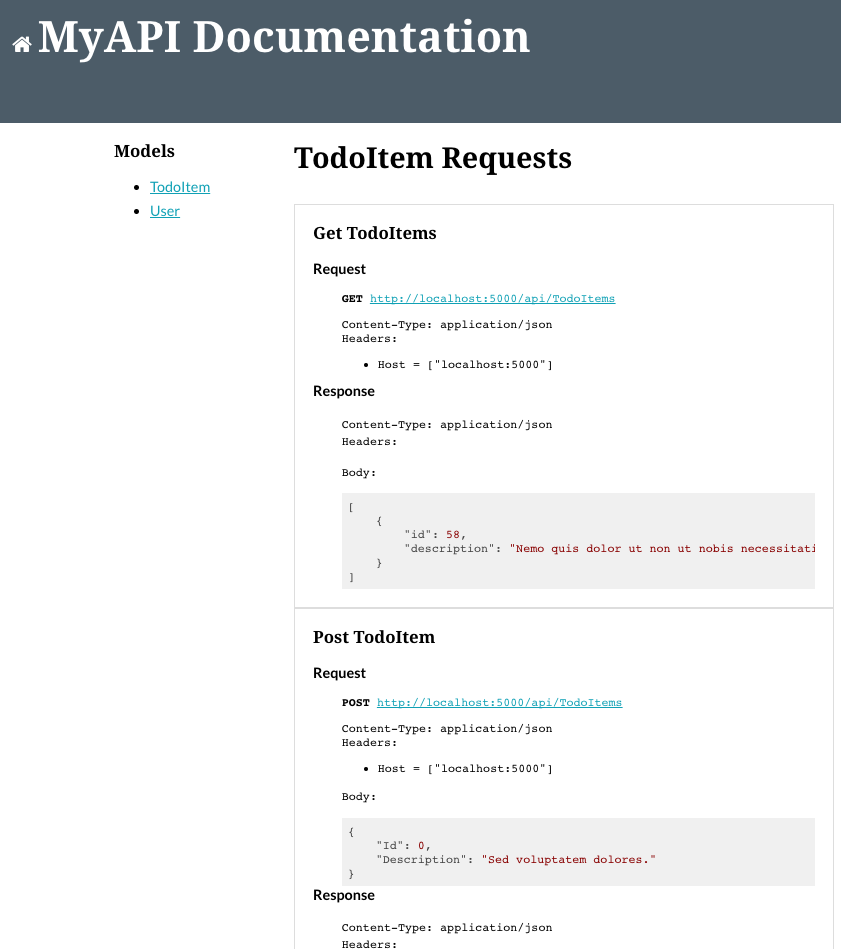

# DotNetCoreDocs

A documentation generator for .Net Core. 

Generate web api documentation from integration tests.

Based on previous work such as [RSpec API Doc Generator](https://github.com/zipmark/rspec_api_documentation).

[](https://ci.appveyor.com/project/jaredcnance/dotnetcoredocs)
[](https://www.nuget.org/packages/DotNetCoreDocs/)



## Installation

Installation using [NuGet](https://www.nuget.org/packages/DotNetCoreDocs/):

```
Install-Package DotNetCoreDocs
```

## Running The Example

```
$ git clone https://github.com/jaredcnance/DotNetCoreDocs.git
$ cd DotNetCoreDocs
$ dotnet restore
$ cd ./test/DotNetCoreDocsExampleTests
$ dotnet test
$ cd ../../src/DotNetCoreDocsExample
$ dotnet run
$ open http://localhost:5000/docs
```

## Usage

See the example projects (`./src/DotNetCoreDocsExample` and `./test/DotNetCoreDocsExampleTests`) for a detailed usage example.

- Add the following to `ConfigureServices` method in `Startup.cs` and add the required configuration to `appsettings.json` (see Configuration below).

```
services.AddDocumentationConfiguration(Configuration);
```

- Add the following to `Configure` method in `Startup.cs`:

```
app.UseDocs();
```

- Write Integrations Tests:
  1. Create a test class that implements `IClassFixture<DocsFixture<TEntity, TStartup, JsonDocWriter>>`
  2. Inject the fixture via the constructor:
     ```
     public TEntityControllerIntegrationTests(DocsFixture<TodoItem, Startup, JsonDocWriter> fixture)
     {
        _fixture = fixture;
     }
     ```
  3. Define a test that makes an HttpRequest using the fixture's `MakeRequest` method
```
public class TodoItemControllerIntegrationTests : IClassFixture<DocsFixture<TodoItem, Startup, JsonDocWriter>>
{
    private DocsFixture<TodoItem, Startup, JsonDocWriter> _fixture;
    private AppDbContext _context;

    public TodoItemControllerIntegrationTests(DocsFixture<TodoItem, Startup, JsonDocWriter> fixture)
    {
        _fixture = fixture;
        _context = fixture.GetService<AppDbContext>();
    }

    [Fact]
    public async Task Can_Get_TodoItems()
    {
        // Arrange
        _context.TodoItems.Add(new TodoItem());
        _context.SaveChanges();

        // Act
        var response = await _fixture.MakeRequest("Get TodoItems", new HttpMethod("GET"), "/api/TodoItems");

        var body = await response.Content.ReadAsStringAsync();
        var deserializedBody = JsonConvert.DeserializeObject<List<TodoItem>>(body);

        // Assert
        Assert.Equal(HttpStatusCode.OK, response.StatusCode);
        Assert.NotEmpty(deserializedBody);
    }
}
```

- Run the tests (`dotnet test`)
- Start your app and navigate to the docs route (default: `http://localhost:5000/docs`)

## Configuration

### Options

| Configuration Key | Description | Default Value | Required |
|----|----|----|---|
| **BaseAddress** | The host address to use when running the tests | http://localhost:5000 | N |
| **RequestsDirectory** | Directory to store the test results (relative to the test project, must be accessible by the api) | N/A | Y |
| **DocumentationRoute** | Documentation route path string. Determines where to mount the documentation | /docs | N |
| **RootTemplatePath** | External Location of the root hbs file | N/A | N |
| **HomeTemplatePath** | External location of the home hbs file | N/A | N |
| **ModelTemplatePath** | External location of the model hbs file | N/A | N |
| **ReadmePath** | External location of the readme markdown file | README.md | N |

### Sample appsettings.json file

```
{
  "DocsConfiguration": {
    "BaseAddress": "http://localhost:5000",
    "RequestsDirectory": "../../src/DotNetCoreDocsExample/_data",
    "DocumentationRoute": "/docs",
    "RootTemplatePath": "../../src/DotNetCoreDocsExample/_templates/root.hbs",
    "HomeTemplatePath": "../../src/DotNetCoreDocsExample/_templates/home.hbs",
    "ModelTemplatePath": "../../src/DotNetCoreDocsExample/_templates/model.hbs",
    "ReadmePath": "README.md"
  }
}
```

### Customizing the Documentation Templates

You can customize the templates by specifying paths to the template hbs files in the configuration. 
There are currently 3 template files:

 - RootTemplatePath: the containing template
 - HomeTemplatePath: the initial outlet template that defaults to rendering the Readme.md file
 - ModelTemplatePath: the template used for model request outlets